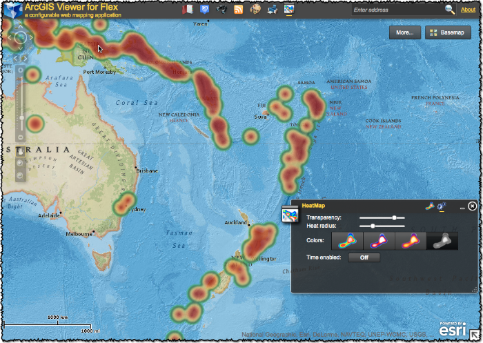

# heatmap-widget-flex

This is the heat map widget source code compatible with the [arcgis-viewer-flex (ArcGIS Viewer for Flex)](https://github.com/Esri/arcgis-viewer-flex "View repository on GitHub") application.

<!-- MAKE SURE TO ALWAYS UPDATE THE VERSION HERE -->

This repository includes:

* The widget source code.
* The ArcGISHeatMapLayer source code.
* The non-widget samples to showcase the ArcGISHeatMapLayer.
* The [Change Log](CHANGELOG.md) containing details about the feature history.
* The [Documentation](../../wiki) for getting started using this repository.
* The latest development is always on the [develop branch](../../tree/develop).
* The latest release is always on the [master branch](../../tree/master).

## Features
* If you are wanting to produce a heat map layer in your ArcGIS Viewer for Flex application take a look at this widget.
* This widget will allow you to easily create a heat map layer from an ArcGIS for Server service [(Earthquakes service)](http://sampleserver3.arcgisonline.com/ArcGIS/rest/services/Earthquakes/Since_1970/MapServer/0) that returns point features.
* Only services that return point features are supported.
* Make sure you are familiar with the service you are using to generate your heat map, as services are configured with a "Maximum number of records to return" and this can limit the features used to generate your heat map.  At ArcGIS version 10.1 this number is 1000 by default.  See the [FAQ](http://resources.arcgis.com/en/help/flex-api/concepts/index.html#/FAQ/017p00000016000000/) for more information related to this topic.

## Instructions
What do you want to do with this widget?

1.  If you are simply going to use the compiled "ready-to-use" version of the HeatMapWidget packaged for the [ArcGIS Viewer for Flex Application Builder](http://resources.arcgis.com/en/help/flex-viewer/concepts/index.html#//01m30000002v000000 "Getting started with Application Builder") proceed to the [documentation for Application Builder](../../wiki/Application-Builder) section.
  
2.  If you are going to compile this widget on your own, make modifications, etc., proceed to the [documentation for Developers](../../wiki/Developers) section.

## Requirements
* Knowledge of Flex development.
* A little background with Adobe/Apache Flex SDK.
* Experience with the [ArcGIS API for Flex](http://links.esri.com/flex) would help.

## Resources
* [ArcGIS Viewer for Flex Resource Center](http://links.esri.com/flexviewer)
* [ArcGIS API for Flex Resource Center](http://links.esri.com/flex)
* [Flex Viewer License agreement](http://www.apache.org/licenses/LICENSE-2.0.html)
* [Flex API License agreement](http://www.esri.com/legal/pdfs/mla_e204_e300/english.pdf)
* [ArcGIS Blog](http://blogs.esri.com/esri/arcgis/tag/flex/)
* [@lheberlie](http://twitter.com/lheberlie)

## Issues
Ask questions on the [HeatMapWidget Forum](http://forums.arcgis.com/threads/76049-heatmap-widget-flex "HeatMapWidget Forum")

Find a bug or want to request a new feature?  Please let us know by [submitting an issue](../../issues).

## Contributing
Anyone and everyone is welcome to contribute.

## Licensing
Copyright 2013 Esri

Licensed under the Apache License, Version 2.0 (the "License");
you may not use this file except in compliance with the License.
You may obtain a copy of the License at

   http://www.apache.org/licenses/LICENSE-2.0

Unless required by applicable law or agreed to in writing, software
distributed under the License is distributed on an "AS IS" BASIS,
WITHOUT WARRANTIES OR CONDITIONS OF ANY KIND, either express or implied.
See the License for the specific language governing permissions and
limitations under the License.

A copy of the license is available in the repository's [license.txt](license.txt) file.

